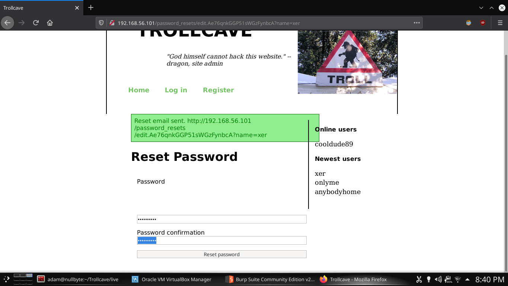
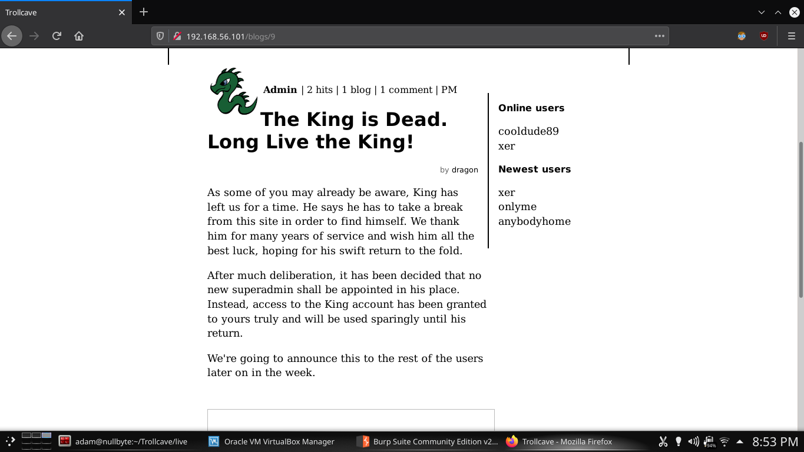
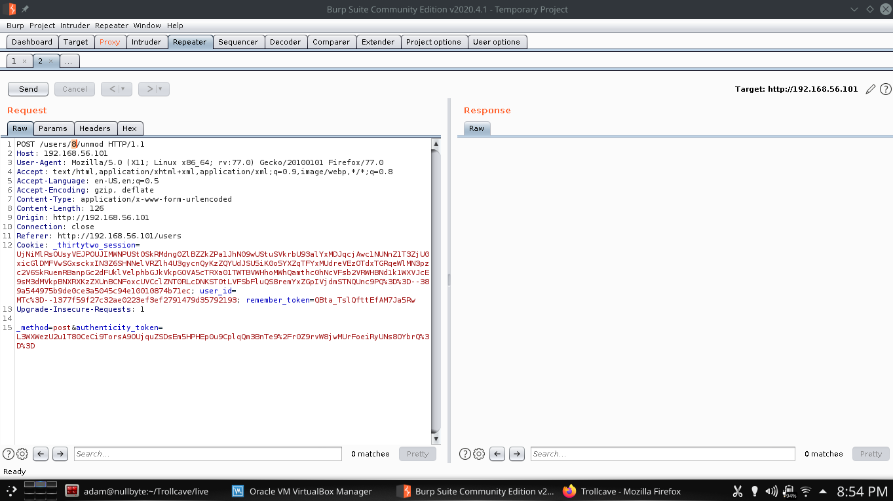

# Trollcave

Trollcave is a vulnerable machine provided by Vulnhub.  The official homepage to the challenge is located at the following address: https://www.vulnhub.com/entry/trollcave-12,230/

## Download

The vulnerable image can be downloaded using the following link: https://download.vulnhub.com/trollcave/trollcave-v1-2.ova

## Verify

The vulnerable OVA file comes with checksums to verify the integrity of the downloaded file.  The checksums are as follows:

+ MD5: 48C974555C34224567D0F8F9DA30ADD2
+ SHA1: DFD1375DB5D5089CE6E657942F2BADB0A91EB7B3

## Hacking

First things first, I determine the IP address of the target server.

The IP address is 192.168.56.101

The next step is to find open ports on the target.

The target is hosting services on port 22 and port 80.

The next step is to determine the service versions.

Port 22 is hosting SSH and port 80 is hosting a web service.

Next step is to check out the web server since SSH is likely a waste of effort.

I checked the source code to see if I could fingerprint the web framework.

The service appears to be Ruby On Rails.

I decided to confirm by checking available variables in the JS console.

The web framework is confirmed, Ruby On Rails.

I decided to look through some of the posts for clues or anything leading to more interesting information.

There is a post that mentions there is a password reset feature that has been added to the service.

I did a quick google search to find the default routes for password resets on Ruby On Rails.

The Ruby On Rails documentation shows that the default password reset route is located at /password_resets/new.

As expected, I found the password resets page.

I tried to reset some high ranked users but the site appears to only allow reset of Member passwords.

I decided to reset the password for the user, xer.

The site provided a link to visit which allows me to set a new password for the user, xer.

I am now able to log in as xer with the role of Member.

After doing some digging, it appears that members are allowed to make comments on posts.

I also discovered after many attempts that the comments are vulnerable to XSS.

I decided to target the user that is currently online since it made the most sense, and the user is also a moderator.

Firstly, need to setup a listener to catch a cookie that I will force through reflected XSS back to my terminal on port 18001.

After setting the listener, I wrote the XSS payload into the comment box and submitted it.

After a few moments, the moderator account's cookie did in fact make a request as a result of the XSS injection and I was able to capture the cookie.

Now that I have the cookie for the moderator, I need to tamper a request to inject it into my traffic.

I modified the header with the stolen cookie and forwarded the request.

I am now logged in as a moderator.

I did some more digging to find some useful info or tactical advantage with my new foothold.

I found a post mentioning that moderators can promote other users to higher roles.

Since I already own xer's account, I decided to target xer.

I promoted xer's account multiple times for good measure, as high as it would allow promotion.

I logged back in as xer and am now assuming the role of Admin as xer.

Time for some more investigation to find out what an Admin role can do.

It appears that Admin have the ability to demote other users.

I found a post by dragon that claims King is away and that dragon is filling in as Super Admin for now.

This could mean that King shared credentials via private messages.

It does not appear to allow the demotion of other Admin users.

I decided to try and demote another moderator with plans to tamper the id to dragon's id.

I demoted dragon a few times to get the account role as low as possible.

Now that dragon has the role of Member, I reset the password using the same routine that I used for xer.

I am now able to log in as dragon.

Time to have a look around.

As suspected, the inbox contains credentials for King.

I used the stolen credentials to sign in as King with the role of Super Admin.

I noticed that the Admin Panel contains some settings, one of which allows me to enable file upload which is always useful.

I did some more digging and found that there was a post mentioning a user *rails* on the system has SSH access.  This also leads me to believe that the user has a dedicated /home directory.

I setup an SSH keypair that I will use as my access to connect to the target as the rails user.

After a lot of testing, I figured out that the file upload has a directory traversal vulnerability that essentially allows you to put a file anywhere in the file system.

I uploaded the rails SSH public key I generated to overwrite /home/rails/.ssh/authorized_keys.

I connected to the target machine via SSH to the rails user.

I snooped around the system, checking for ports that were listening and noticed there is a service running on port 8888.

I then checked running processes for something that could explain the service on port 8888 and noticed that there was a nodejs process running as king which is likely the cause.

I then began fuzzing the service to see if there were any weak points.  One thing I noticed is that the service is only listening on localhost.  I also noticed that the JS script was accepting user input and running it in an *eval* statement which is vulnerable to injection.

I crafted a malicious bash script in /tmp with instructions to write the same SSH public key into king's home directory, since the script runs with king's privileges.

I executed the malware by pointing the JS child_process to the malicious script in /tmp.

I then connected directly to king via SSH and was able to access without any issues.

First thing I checked was king's sudo rules and noticed that king can run any command as root with sudo.

I ran a simple `sudo bash` to get a root shell and captured the flag.
